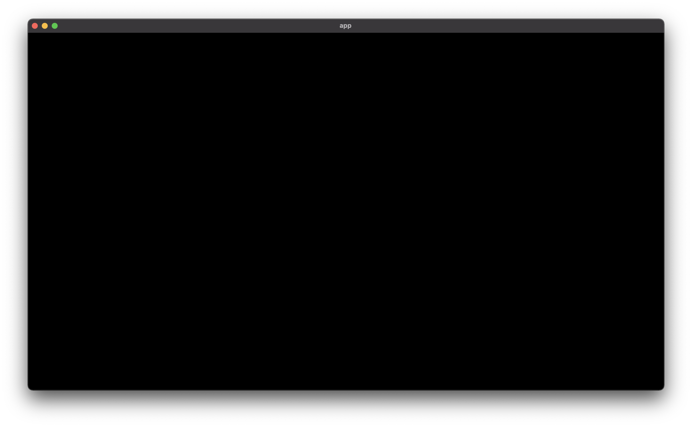
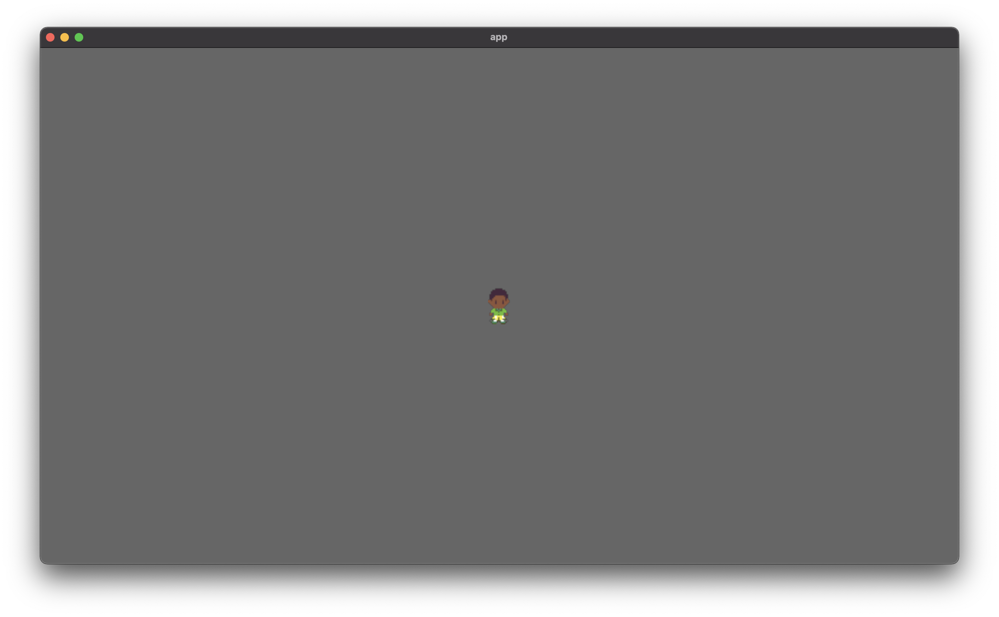
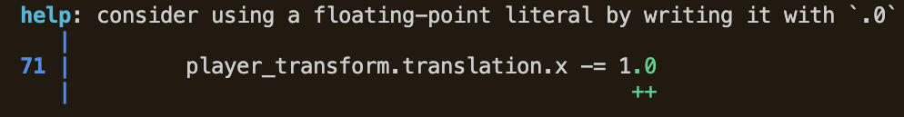
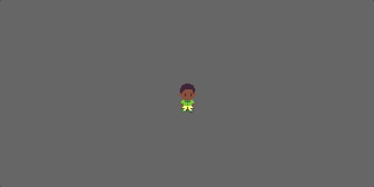

# Part 1: A Basic Sprite

We're going to program a top-down, [Stardew Valley](https://en.wikipedia.org/wiki/Stardew_Valley)-style game in [Rust](https://www.rust-lang.org). Rust is a strongly typed, systems programming language, a spiritual successor to C++ that's been getting a lot of goodwill in programming communities. We'll use the [Bevy library](https://bevyengine.org) to program the game from scratch.

First, install [Rust](https://www.rust-lang.org) and [Bevy](https://bevyengine.org). Do the Bevy [tutorial](https://bevyengine.org/learn/book/getting-started/) (until you get to "Next Steps" section).[^note1] Setup a project with a single file with the following code:

```rust
use bevy::prelude::*;

fn main() {
    App::new()
        .add_plugins(DefaultPlugins)
        .add_startup_system(setup)
        .run();
}

fn setup(mut commands: Commands, asset_server: Res<AssetServer>) {

}
```

Done? Let's continue.

## Display a sprite

Our first step is to get something displayed. A little pixel art character will do the trick. For sprites, we'll use Mother 3-style characters I made several years back. (I'll admit there is an ulterior, selfish reason I centered this around Stardew Valley!) Download the following:


For now, let's just worry about getting a single image to display and get it to react to keyboard input; later, we'll see how to deal with animations through spritesheets.

As you might've read in the Bevy Book, Bevy follows the ECS (entity-component-system) game engine architecture, like [so many engines](https://unity.com/ecs) these days. "Entity" is probably the easiest to understand of the three terms ---it simply means an object (a "thing") with a unique ID (identifier) that refers to it. Entities are what you'll "spawn" into a game "World." An Entity can have a number of Components. Components are like properties of an entity ---its position, characteristics, and so on. Systems are procedures or functions which operate on kinds of entities. When writing code, you'll spawn many entities, but you'll most concern yourself with Components and Systems, since these will be what you specialize and define.

Let's think about how we can break down our problem into Entit(ies), Component(s), and System(s). First, we have a single entity, our character. Simple enough. For Components, we want our character to have a position (x-y coordinates), a sprite (the pixel art or image), and perhaps other useful properties, such as what direction they are moving in or whether they like to eat too much ice cream. For Systems, we must think about how our characters' components will react to input events (keyboard, gamepad buttons, etc) and the rest of the game world (colliding with walls, talking to NPCs, etc).

In Bevy, the common Components for a 2D sprite are called a `SpriteBundle`. We can "spawn" a `SpriteBundle` by adding the following command to our `setup` function:[^note2]

```rust
commands.spawn((
    SpriteBundle {
        texture: asset_server.load("<PATH_TO_IMAGE>"),
        ..default()  // Set remaining arguments to their default values
    }
));
```

Bevy looks for an `assets` folder for your project resources like images, audio, and so on. I created an `assets` folder in my project directory, added an `images` subfolder, and put `thomas_stand.png` inside of it. `<PATH_TO_IMAGE>` above is then:

```rust
"images/thomas_stand.png"
```

You might wonder why it says `SpriteBundle`, and not just Sprite. A [Bundle](https://bevy-cheatbook.github.io/programming/ec.html#component-bundles) in Bevy is just a "bundle" of Components, so we're just adding several components at once with this operation. These components include a "texture" (an image) and a "transform" (position, rotation, and scale; this isn't listed in the parameters above, but we can add it). We aren't limited to the Components predefined in a `SpriteBundle` ---by virtue of the ECS architecture, we can add however many more Components we'd like to our character entity.

In fact, let's define a new Component right now, `Direction`, to keep track of [8 cardinal directions](https://en.wikipedia.org/wiki/Cardinal_direction) our character could face in. Add this near the top of your Rust file:

```rust
#[derive(Component)]
enum Direction {
    N, NE, E, SE, S, SW, W, NW,
}
```

(Here, "N" stands for north, "NE" for northeast, and so on. North would be "up"-ward movement, south "down," etc.) 

We can give our character entity the `Direction` component by appending it to the end of our spawn command, like so:

```rust
commands.spawn((
    SpriteBundle {
        texture: asset_server.load("<PATH_TO_IMAGE>"),
        ..default()  // Set remaining arguments to their default values
    },
    Direction::S,
));
```

Our character starts by facing south (down).[^note3]

Now let's display our sprite to the screen. We already have everything we need to do this, so try to Run this code. (In VSCode, you can click Run above the main function. In the command line, `cd` to your project directory and then do  `cargo run`). You should see:



That's right: nothing! No, this isn't a cruel joke. It turns out that we're missing something that will tell Bevy how to draw the coordinate system: a **2D camera**. Let's spawn a camera in the "setup" function, and give it a scale of `0.5`, which means it's zoomed in 2x:

```rust
commands.spawn(
    Camera2dBundle {
        transform: Transform::from_scale(Vec3::new(0.5, 0.5, 1.0)),
        ..default()
    }
);
```

Now Run this code. You should get a window like:



Notice two things: the window is quite large, and the character is a bit blurry. To fix these quality-of-life issues, we can change the main function to:

```rust
fn main() {
    App::new()
        .add_plugins(DefaultPlugins
            // Set the image display format to nearest-neighbor for crisp pixels
            .set(ImagePlugin::default_nearest())

            // Set the window name and size
            .set(WindowPlugin {
                window: WindowDescriptor {
                    title: "My Game Project".to_string(),
                    width: 800.,
                    height: 600.,
                    ..default()
                },
                ..default()
            }))
        .add_startup_system(setup)
        .add_system(move_character)
        .run();
}
```

Now you should see:


## Very basic movement

Good start, but our little character can't move! To give them movement, we need to define a custom System that operates on the state of the keyboard. Here, we're getting a predefined "entity" ---the keyboard "resource"  ---and operating on it:

```rust
fn move_character (keyboard_input: Res<Input<KeyCode>>) {
    ...
}
```

But wait! What's that you say? How do we access our character from this function?

That's a good question. In Bevy, accessing other entities  is accomplished through "query"ing their components (you can think of this like filtering entities by their components, and operating on only those entities which have the components which you're matching on). We can add a query to access our player character entity:

```rust
fn move_character (keyboard_input: Res<Input<KeyCode>>,
                   mut query: Query<&mut Transform, With<Direction>>) {
    ...
}
```

But this isn't specific enough. For, if we add any NPCs that also have a `Direction` component, our keyboard inputs will move those characters as well ---and we don't want that! To avoid this problem, we can make our "player" character unique by defining a `Player` component:

```rust
#[derive(Component)]
struct Player;
```

and tacking it onto our entity definition:

```rust
commands.spawn((
    Player,
    Direction::S,
    SpriteBundle {
        texture: asset_server.load("images/thomas_stand.png"),
        ..default()
    },
));
```

(For readability, I've moved our `Direction` component up.)

Now, if we especially want to get the Player  ---and only the Player  ---in a System, we can. We can modify our `move_character` System to capture the Player:[^note4]

```rust
fn move_character (keyboard_input: Res<Input<KeyCode>>,
                   mut query: Query<&mut Transform, With<Player>>) {
    ...
}
```

To get our character to move, we need to access the keyboard events. Fill in the body of our `move_character` function with:

```rust
if keyboard_input.pressed(KeyCode::Left) {
    info!("'Left arrow' currently pressed");
}
if keyboard_input.just_pressed(KeyCode::Left) {
    info!("'Left arrow' just pressed");
}
if keyboard_input.just_released(KeyCode::Left) {
    info!("'Left arrow' just released");
}
```

Run this code, and press the left arrow key. Notice the command line: you should see a number of messages responding to your presses.

Now let's make the player move. We don't need all the keyboard input events above --let's just track .pressed. (Later, we'll improve on our movement logic.) Thanks to our modifications to the move_character function, the player character should be the sole result of the "query" parameter. But we don't get the character entity itself; instead, we get the Component(s) we included in the query. For the query above we have

```rust
Query<&mut Transform, With<Player>>
```

`With<Player>` means "the returned entit(ies) must have a `Player` component, but don't give me access to that component." Above, we only get access to the Transform Component. But how?
We can get the transform by calling a method on the "query" variable. There's many possibilities (try typing `query.` in VSCode, and see what comes up), but the best one for our context is `query.single_mut()`, which gets a single mutable reference: 

```rust
let mut player_transform = query.single_mut();
```

We can change the x-coordinate by modifying `player_transform.translation.x`. For instance:

```rust
if keyboard_input.pressed(KeyCode::Left) {
    player_transform.translation.x -= 1
}
```

This code says: if the left arrow key is pressed, move the player left on the x-axis (in a negative direction) by 1. However, if you try to run it, you can't. Why?

If you are in VSCode or a similar editor with a linter, the tool should underline part of this line in red, with an error like:

```
cannot subtract-assign `{integer}` from `f32`
the trait `SubAssign<{integer}>` is not implemented for `f32`
```

If you try to run the code, you get a helpful error message:



Aha. In Rust, there is no implicit type conversion between integers (whole numbers like 1,2,3 etc) and floats (decimals like 3.14). If we want to subtract 1, we must either type 1.0, or "`1 as f32`," meaning number-1-represented-as-a-float-with-32-bits. (More on the `as` keyword [here](https://doc.rust-lang.org/reference/expressions/operator-expr.html#type-cast-expressions).)

Running the fixed code and pressing the left key, you should see:



It's a bit simple, but **we've got movement!** :)

## Conclusion

That's enough for now. In Part Two of this series, we'll animate our character movement and cover spritesheets and animations. After that, we'll focus on getting this movement to feel "good"  ---little details we can add to improve the feel of movement. Most game development tutorials brush over this step, but it's critical to good design.

See you next time!

-------------

### Footnotes

[^note1]: Also see the extremely useful reference guide, the [Bevy Cheatbook](https://bevy-cheatbook.github.io/tutorial.html). Whenever you are confused or simply want more information about a Bevy concept, check it out!

[^note2]: Notice that our "setup" function is referred as a (special kind of) System in the `add_startup_system` call. A Command is a Bevy-specific term for creating and modifying entities, with operations such as:
- spawning or despawning entities
- inserting components on new or existing entities
- inserting resources (graphics, audio, etc)

[^note3]: Notice the benefits of the ECS architecture. In past game engines with object-oriented framework, we might have made our player character a class `Character`, and added a property for `Direction`. E.g., in Python:
```python
class Character:
    def __init__(self, x, y, direction):
        self.x = x
        self.y = y
        self.direction = direction
```
However, other types of objects might also want a `Direction` property, in which case we'd have to either a) give other classes a separate `Direction` property, duplicating information, b) create a more generic class than `Character`, such as `MoveableSprite`, and have `Character` inherit from it, or c) make a "protocol" like `HasDirection`, to indicate certain classes have a `Direction` property. In ECS, we avoid this trouble by describing entities entirely by their components/properties, the latter of which are reusable without having to write duplicate code.

[^note4]: Programmers from an object-oriented background, more familiar with "instances" of "classes," might find this odd. Why can't we just write `player = Character(…)` and then refer to the "player" variable in a keyboard event? Indeed, this may be one benefit of prior architectures ---it's simpler to read `player.x -= 1.0`, for instance. But usually in a game, we don't have only one instance of an object, but several at once, all behaving similarly. And the player here still has to operate by rules other objects have to operate by, such as colliding with walls. So what we lose in readability in certain places, we get back in power and generalizability.
