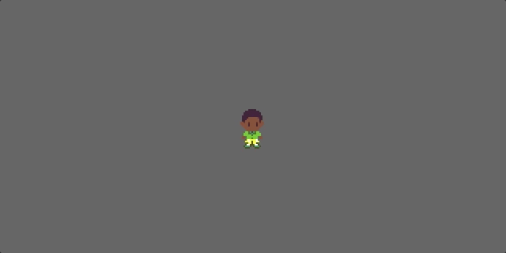

# Part 2: Spritesheet Animation

In Part 1, we created our player character and basic leftward movement:


In this part, we'll delve into the nitty-gritty of spritesheet animation and the start of 8-directional movement. We'll substantially revise our keyboard event function, `move_character`, and create a new System for handling animation via spritesheets.

## Animation

Bevy is great for a lot of things, but it doesn't have built-in support for 2D animation logic. We need to code this ourselves.

#### Loading our spritesheet

We'll be using spritesheets for animation. For simplicity, each character or object will have its own spritesheet. Here's Thomas's:


To load this spritesheet, we'll use a `TextureAtlas`. First, change your `setup` function header to:

```rust
fn setup(mut commands: Commands,
         asset_server: Res<AssetServer>,
         mut texture_atlases: ResMut<Assets<TextureAtlas>>) {
```

This gives us access to the `TextureAtlas` assets loaded by Bevy. To load our spritesheet, in the body of the `setup` function, add:

```rust
let texture_handle = asset_server.load("images/thomas_walk.png");
let texture_atlas = TextureAtlas::from_grid(
                        texture_handle,
                        Vec2::new(16.0, 32.0), // the cell size
                        15, 1, None, None); // columns, rows, padding, offset
let texture_atlas_handle = texture_atlases.add(texture_atlas);
```

Spritesheets contain frames of animation as cells, usually of sizes that correspond to magnitudes of 2 (above, 16 pixels wide by 32 pixels tall). You'll notice that Thomas's spritesheet has three frames of animation per each direction (down, down-left, left, up-left, up). You might think this is missing a few directions ---what about right, up-right, and down-right? In fact, we already have enough information: we can achieve these directions by slipping individual frames on the x-axis (flip-x) as needed.

But there's another problem. If you try to animate this character, say the "down" movement, the animation will look off. That's because we're going to reuse the first frame (stand-down) in between the second and third frames.

#### Encoding spritesheet animations

We need some way of specifying all of this information. The `TextureAtlas`  allows us to specify sprites by indexes (integers) of frames, but that's about it. We need to be able to:
- group select frames and name them, e.g."walk-down", "walk-up", etc,
- specify whether a frame should be x-flipped or not,
- control how fast each animation runs, and
- specify what the animator should do after it reaches the last frame (loop, stop, reverse, etc.)

Here are some Rust datatypes that accomplish this:

```rust
// A timer for animations
#[derive(Component, Deref, DerefMut)]
struct AnimationTimer(Timer);

// How the animation should continue after it reaches the last frame
enum AnimationStyle {
    Once,    // Play once and end at last frame
    Looping, // Loop from frame 1 to n, then from 1 to n, ad infinitum
}

// A SpritesheetAnimation is a series of indexes for a TextureAtlas,
// referencing the frames to use for a single animation. The "fps" is
// how fast to display the animation.
// NOTE: You will be able to use negative frame id's to represent x-flipped textures
struct SpritesheetAnimation {
    frames: Vec<i8>, // the frames of the animation, as the TextureAtlas' indices+1
    fps: f32, // how quickly to go to the next frame, in frames per second
    looping: AnimationStyle // whether and how to loop the animation
}

// A SpriteAnimator is a map from "states" (strings)
// to individual animations.
#[derive(Component)]
struct SpritesheetAnimator {
    states: HashMap<String, SpritesheetAnimation>,
    timer: AnimationTimer,
    cur_state: String,
    cur_frame_idx: usize,
}
```

The `SpritesheetAnimator` contains all of the animations for a particular sprite ("`states`") as mappings from names of the state, to a particular animation ("`SpritesheetAnimation`"). Each `SpritesheetAnimation` describes a series of frames as indices of the sprite's `TextureAtlas`, the speed of the animation ("`fps`") and what to do when it reaches the end of play ("`looping`").

Now let's add a `SpriteAnimator` that contains the animations for our player character sprite. For now, let's just worry about the "stand-down" and "move-down" animations. How do we load and encode these in Bevy?

```rust
let player_animations = SpritesheetAnimator {
    states: HashMap::from([
        ("stand-down".to_string(), SpritesheetAnimation {
            frames: vec![1],
            fps: 5.0,
            looping: AnimationStyle::Once
        }),
        ("move-down".to_string(), SpritesheetAnimation {
            frames: vec![1, 2, 1, 3],
            fps: 5.0,
            looping: AnimationStyle::Looping
        }),
    ]),
    timer: AnimationTimer(Timer::from_seconds(0.2, TimerMode::Repeating)),
    cur_state: "move-down".to_string(),
    cur_frame_idx: 0
};
```

You should notice a few things:
1. The animation frame indices start from 1, not 0. This is a choice: since we're encoding "flip-x" as negative, we can't use 0, or we couldn't flip that frame. So, the frame indices here are +1 the TextureAtlas indices.
2. Like I described earlier, in "move-down", we've used the 1st frames of animation twice to intersperse the standing frame. This is the benefit of how we've encoded this information: we could've just incremented the frame indices, like in the [Bevy spritesheet example code](https://github.com/bevyengine/bevy/blob/v0.9.1/examples/2d/sprite_sheet.rs), but we'd lose the ability to reuse frames.
3. "Standing" sprites, when the character isn't moving, we treat as a special kind of animation: one with a single frame. (It won't really matter what the `fps` value is for static animations.)

Since this can get unwieldy, we can implement a helper constructor for `SpritesheetAnimation` that fills in defaults for `fps` and `looping`:

```rust
const DEFAULT_ANIMATION_FPS: f32 = 5.0;

impl SpritesheetAnimation {
    fn from_frames(frames: Vec<i8>) -> Self {
        Self {
            frames,
            fps: DEFAULT_ANIMATION_FPS,
            looping: AnimationStyle::Looping
        }
    }
}
```

Now our animation definitions can be one-liners:

```rust
...
("stand-down".to_string(), SpritesheetAnimation::from_frames(vec![1])),
("stand-down-left".to_string(), SpritesheetAnimation::from_frames(vec![4])),
...
("move-down".to_string(), SpritesheetAnimation::from_frames(vec![1, 2, 1, 3])),
("move-down-left".to_string(), SpritesheetAnimation::from_frames(vec![4, 5, 4, 6])),
...
```

The rest of the movement and stand animations follow the same pattern. Add to the code above to encode these yourself, using names like "stand-up", "move-down-left", etc. For directions that require flipping the sprite, use negative indices, like so:

```rust
...,
("move-right".to_string(), SpritesheetAnimation::from_frames(vec![-7, -8, -7, -9]))
...
```

Eventually, we'll want to offload this type of information into data files (e.g., in JSON format); for now though, we'll specify it directly in `setup`.

#### Defining our animation system

We've covered how to encode animations, but none of that matters until we make a System to read and play the animations: to update the player sprite's current texture, keep track of time, flip the player sprite based on whether the frame is negative or positive, etc.

That system we might call `animate_sprites`, and it shows the benefit of the ECS architecture: we're defining how `SpritesheetAnimator` works *for any entity that uses it*, not just our player character. The code is rather involved, but we only need to write it once:

```rust
fn animate_sprites(
    time: Res<Time>,
    texture_atlases: Res<Assets<TextureAtlas>>,
    mut query: Query<(
        &mut SpritesheetAnimator,
        &mut TextureAtlasSprite,
        &Handle<TextureAtlas>,
    )>,
) {
    for (mut animator, mut sprite, texture_atlas_handle) in &mut query {

        let timer = &mut animator.timer;
        timer.tick(time.delta());

        if timer.just_finished() {
            // Get reference to spritesheet texture
            let texture_atlas = texture_atlases.get(texture_atlas_handle).unwrap();

            // Get reference to current animation and advance to next frame
            let mut next_frame_idx: usize = animator.cur_frame_idx;
            if let Some(anim) = animator.states.get(&animator.cur_state) {

                // Advance to the index of the next frame
                let num_frames = anim.frames.len();
                if (animator.cur_frame_idx + 1) >= num_frames {
                    if matches!(anim.looping, AnimationStyle::Looping) {
                        next_frame_idx = 0;
                    }
                } else {
                    next_frame_idx = animator.cur_frame_idx + 1;
                }

                // Set the sprite frame and x-flip value
                let next_frame_texture = anim.frames.get(next_frame_idx);
                if let Some(texture_idx) = next_frame_texture {
                    sprite.index = (((*texture_idx).abs()-1) as usize) % texture_atlas.textures.len();
                    sprite.flip_x = (*texture_idx) < 0; // flip texture if negative
                }
            }

            animator.cur_frame_idx = next_frame_idx;
        }
    }
}
```

We then add this System to our `main` function:

```rust
    ...
    .add_startup_system(setup)
    .add_system(animate_sprites)
    ...
```

To be careful, we also want to implement a constructor for the `SpritesheetAnimator`:

```rust
impl SpritesheetAnimator {

    fn new(states: HashMap<String, SpritesheetAnimation>,
           start_state: String) -> Self {

        match states.get(&start_state) {
            Some(anim) => {
                if anim.fps as f32 == 0.0 {
                    panic!("Frames per second must be positive, nonzero value")
                }
                Self {
                    timer: AnimationTimer(Timer::from_seconds(1.0 / anim.fps, TimerMode::Repeating)),
                    states: states,
                    cur_state: start_state,
                    cur_frame_idx: 0,
                }
            },
            None => {
                panic!("Start state {} not found", start_state)
            },
        }
    }
}
```

Now we can use our constructor instead of setting up a `SpritesheetAnimator` directly, to set the starting animation directly from our list of passed states. The full definition is:

```rust
let player_animations = SpritesheetAnimator::new(
    HashMap::from([
        ("stand-down".to_string(), SpritesheetAnimation::from_frames(vec![1])),
        ("stand-down-left".to_string(), SpritesheetAnimation::from_frames(vec![4])),
        ("stand-left".to_string(), SpritesheetAnimation::from_frames(vec![7])),
        ("stand-up-left".to_string(), SpritesheetAnimation::from_frames(vec![10])),
        ("stand-up".to_string(), SpritesheetAnimation::from_frames(vec![13])),
        ("stand-up-right".to_string(), SpritesheetAnimation::from_frames(vec![-10])),
        ("stand-right".to_string(), SpritesheetAnimation::from_frames(vec![-7])),
        ("stand-down-right".to_string(), SpritesheetAnimation::from_frames(vec![-4])),
        ("move-down".to_string(), SpritesheetAnimation::from_frames(vec![1, 2, 1, 3])),
        ("move-down-left".to_string(), SpritesheetAnimation::from_frames(vec![4, 5, 4, 6])),
        ("move-left".to_string(), SpritesheetAnimation::from_frames(vec![7, 8, 7, 9])),
        ("move-up-left".to_string(), SpritesheetAnimation::from_frames(vec![10, 11, 10, 12])),
        ("move-up".to_string(), SpritesheetAnimation::from_frames(vec![13, 14, 13, 15])),
        ("move-up-right".to_string(), SpritesheetAnimation::from_frames(vec![-10, -11, -10, -12])),
        ("move-right".to_string(), SpritesheetAnimation::from_frames(vec![-7, -8, -7, -9])),
        ("move-down-right".to_string(), SpritesheetAnimation::from_frames(vec![-4, -5, -4, -6])),
    ]),
    "move-down".to_string()
);
```

Putting it all together and running your code, you should get:


Voila! Now to trigger our animation states with keyboard input.

## Changing animations based on keyboard input

First, we'll need another helper function to change the state of a `SpritesheetAnimator` together with the `TextureAtlasSprite` index:

```rust
impl SpritesheetAnimator {

    ...

    fn set_state(&mut self, state_name: String, sprite: &mut TextureAtlasSprite) -> bool {
        match self.states.get(&state_name) {
            Some(state) => {
                if state.fps as f32 == 0.0 {
                    panic!("Frames per second must be positive, nonzero value")
                }
                self.cur_state = state_name;
                self.cur_frame_idx = 0;
                self.timer = AnimationTimer(Timer::from_seconds(1.0 / state.fps,
                                            TimerMode::Repeating));
                // Set the sprite frame and x-flip value
                if let Some(texture_idx) = state.frames.get(0) {
                    sprite.index = ((*texture_idx).abs()-1) as usize;
                    sprite.flip_x = (*texture_idx) < 0; // flip texture if negative
                }
                true
            },
            None => false,
        }
    }
}
```

Now we can adjust our keyboard input method to change the `SpritesheetAnimator` state based on which keys are pressed. We'll rename it to `player_input` and change the query to capture our new `SpritesheetAnimator` and `TextureAtlasSprite` components:

```rust
fn player_input (keyboard_input: Res<Input<KeyCode>>,
                 mut query: Query<(&mut SpritesheetAnimator, &mut TextureAtlasSprite), With<Player>>) {

    let (mut animator, mut sprite) = query.single_mut();

    let (left_pressed, up_pressed, right_pressed, down_pressed) =
        (keyboard_input.pressed(KeyCode::Left), keyboard_input.pressed(KeyCode::Up),
        keyboard_input.pressed(KeyCode::Right), keyboard_input.pressed(KeyCode::Down));

    let mut facing: &str = "";
    if left_pressed {
        if up_pressed {
            facing = "move-up-left";
        } else if down_pressed {
            facing = "move-down-left";
        } else {
            facing = "move-left";
        }
    } else if right_pressed {
        if up_pressed {
            facing = "move-up-right";
        } else if down_pressed {
            facing = "move-down-right";
        } else {
            facing = "move-right";
        }
    } else if up_pressed {
        facing = "move-up";
    } else if down_pressed {
        facing = "move-down";
    }

    // If a key is pressed and the state would change
    if facing.len() > 0 && animator.cur_state != facing.to_string() {
        animator.set_state(facing.to_string(), &mut sprite);
    }
}
```

Run this code, and press the arrow keys. The character should move in the direction(s) you press:



We might change this code later, but it's good to see the results of our hard work.

## Conclusion

Whew, that was a lot. In Part 3, we'll cover movement, extend our `Direction` component to capture what direction a character is facing, and separate input from animation.

-------------

### Code
[Get the finished code for this part.](game_code/chapter_2.rs)
