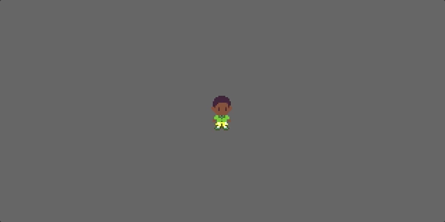
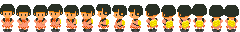
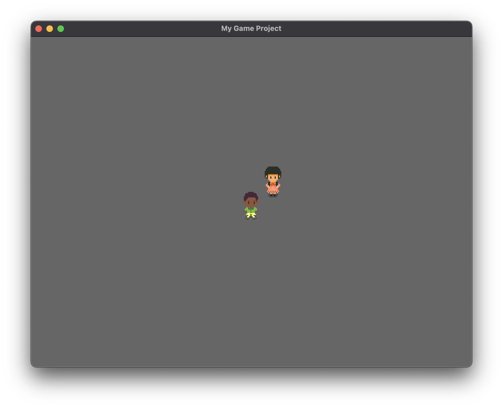
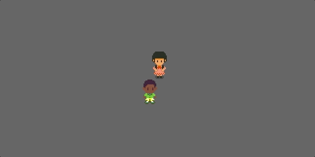
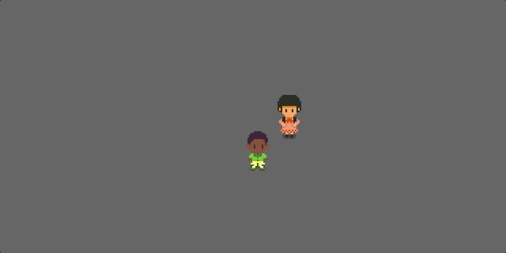

# Part 4: More Characters

In Part 3, we got our player character moving:



So far so good, right? Our natural inclination might be to proceeding to filling in the gray background ---to load tilemaps and do collision with walls. However, are we really "done" with characters? What if we want to add a second, non-player character, and have it walk around? Do our existing abstractions make this possible?

Nope. Looking closer, we've done a pretty poor job: all of our movement code is in our keyboard event, `player_input`. In other words, all walking movement and animation is triggered solely by key presses, and only for our player character. We can’t use this code for a [non-player character (NPC)](https://en.wikipedia.org/wiki/Non-player_character), or they’d only move in response to key presses, too. If we want them to walk, say, along a preset path, we need two things:
- a general system that works for any “character” (player or non-player) that controls their walk and movement animations,
- some way to specify a path or direction a character should walk in

Together, this means we need some way to control character *state*, abstracted away from any particular means of *triggering* state changes. Our current model is too low-level: whenever we want to move the character, we have to independently change the animations and velocity. What we’d prefer to do is tell a character entity "move up at speed X," and have the movement speed and animation frame rate respond together. Then we can build even higher-level abstractions that puppeteer characters, say on set paths (like in cutscenes).

## Developing a `Character` component

Let’s add a component for characters. A `Character` will have a state, and be initialized with a set of possible states it could be in. Think “walk-left,” “run-up,” “sleep,” “fall-over,” and so on. Each state has a corresponding `SpritesheetAnimator` state (how the character should be rendered for that state), fps (how fast the animation should play), and movement vector (velocity).[^note1] With a `Character`, we can simply change the character’s overall state, and then write a system that updates the character’s `SpritesheetAnimator` and `Transform` components accordingly. To demonstrate the advantage of this setup, we will add a second character, and have them walk along a preset path.[^note2]

To take full advantage of `Character` components, we’ll first offload our velocity-based update of an entity’s `Transform` to a general component, `Velocity`. This component will simply store velocity and update an entity’s `Transform` component every cycle. In other words, instead of these lines in our `player_input` method:

```rust
move_delta = (move_dir.0 * move_speed * time_delta,
              move_dir.1 * move_speed * time_delta);
// Apply move delta to character position:
transform.translation.x += move_delta.0;
transform.translation.y += move_delta.1;
```

we will move them to a separate System for a new component, `Velocity`.

### Defining `Velocity` and a `delta_seconds!` macro

We define the component,

```rust
#[derive(Component)]
struct Velocity {
    x: f32,
    y: f32,
}
impl Velocity {
    fn new(x: f32, y: f32) -> Self {
        Self { x, y }
    }
    fn zero() -> Self {
        Self { x: 0.0, y: 0.0 }
    }
}
```

and write a system that operates on all entities with a `Velocity` and a `Transform`:

```rust
fn apply_velocity(
    time: Res<Time>,
	mut query: Query<(&Velocity, &mut Transform)>,
) {
    let time_delta: f32 = time.delta_seconds();
	for (velocity, mut transform) in query.iter_mut() {
		let translation = &mut transform.translation;
		translation.x += velocity.x * time_delta;
		translation.y += velocity.y * time_delta;
    }
}
```

Again, we used a `Time` resource so we can use velocity values independent of the game refresh rate.[^note3]

We might think we're done here, but consider what would happen if `time_delta` was "large", say a full second. Consider if we had implemented collision between objects. Objects moving fast might go straight through each other, or clip through walls, if the system hardware slowed down for a second! That could break our game. To prevent this, we can clamp the magnitude of `time_delta` to something reasonable, like 10 fps:

```rust
let time_delta: f32 = time.delta_seconds().max(0).min(1./10.);
```

Now no matter how much the system slows down, the game itself will only see update events at most 0.05 "seconds" long, and no longer.

However, this is only true for the `Velocity` system... whenever we want to get the time delta, we'll need to clamp the values. So it's better to create general macro for this operation:

```rust
macro_rules! delta_seconds {
    ($t:ident) => {$t.delta_seconds().max(0.).min(1./10.)}
}
```

Then:

```rust
let time_delta: f32 = delta_seconds!(time);
```

and we can use `delta_seconds!(time)` whenever we need to get the elapsed time between updates, and forget about the clamping to 10 fps.[^note4]

### Defining `Character`

Now we're ready to define a component for characters. A `Character` is like our `SpritesheetAnimator`, in that it has a current state, and a set of possible states it could be in:

```rust
#[derive(Component)]
struct Character {
    states: HashMap<String, ???>,
    cur_state: String,
    prev_state: String,
}
```

But what is the type of the `HashMap`'s values? Well, we said above that a character's state involves two things: an animation state, and a movement vector (a velocity). We can separate this out into a struct, `CharacterState`:

```rust
struct CharacterState {
    animation: String,
    movement: Velocity,
}
```

Thus, a Character assumes an entity it is attached to has a Velocity and an Animator, and its system updates only those components. In turn, those components have their own independent systems for updating the entity’s Transform and Texture. (Notice that we re-use our `Velocity` struct here ---but this time, just as a struct, not a component in Bevy.)

Going back to our `Character` component, now we have:

```rust
#[derive(Component)]
struct Character {
    states: HashMap<String, CharacterState>,
    cur_state: String,
    prev_state: String,
}
```

We should also add a constructor, so we don't have to worry about setting `cur_state` and `prev_state` manually:

```rust
impl Character {
    fn new(states: HashMap<String, CharacterState>, start_state: String) -> Self {
        match states.get(&start_state) {
            Some(state) => Self {
                states,
                cur_state: start_state,
                prev_state: "".to_string(),
            },
            None => panic!("Start state {} not found", start_state)
        }
    }
}
```

Now we will write a system which (1) detects changes to a `Character`'s state `cur_state`, and (2) updates an entity's `SpritesheetAnimator` and `Velocity` components ---not just for our player, but *for any character* in the game:

```rust
fn update_character_state(
	mut query: Query<(&mut Character, &mut SpritesheetAnimator, &mut TextureAtlasSprite, &mut Velocity)>,
) {
	for (mut character, mut animator, mut sprite, mut velocity) in query.iter_mut() {
		// Check if cur_state differs from prev_state
        if character.cur_state == character.prev_state { continue; };

        // Update the state by changing animator and transforms:
        if let Some(char_state) = character.states.get(&character.cur_state) {
            animator.set_state(
                String::from(char_state.animation),
                &mut sprite,
                None);
            velocity.x = char_state.movement.x;
            velocity.y = char_state.movement.y;
        }

        character.prev_state = String::from(character.cur_state);
    }
}
```

Now we won't touch the `SpritesheetAnimator` directly ---instead, if we want to change the `Character` animation, we must declare a `CharacterState` and change it indirectly through this system. While this approach may seem overly abstract, it is very powerful: it allows us to create a second, non-player character, or indeed however many characters we want.

## Spawning a friend

Let's spawn a friend for Thomas to interact with. Our second character will be Missy:



(Notice that Missy's spritesheet is in the same format as Thomas's. We'll use this to easily define her walk animations analogously to Thomas's.)

How do we spawn Missy in code? Of course we update our `setup` system, but do we have to do anything special outside of what we've done for Thomas?

**No!** We don't! That's amazing --effectively, both Thomas and Missy will be seen as `Character`s. Only the `Player` flag on Thomas' character entity will distinguish him from Missy. (In fact, if we wanted to change characters mid-game, all we'll have to do is remove the `Player` component from the Thomas entity and give it to the Missy entity! By the end of this lesson, we'll have done exactly this ---to change who we're playing simply by pressing the Space bar.)

First, we have to update our `setup` code to add `Character` and `Velocity` components. First define two helpful constants:

```rust
const WALK_SPEED: f32 = 32.0;
const DIAG: f32 = 0.71;
```

Our `Character` component is then the lengthy:

```rust
Character::new(HashMap::from([
    ("stand-down".to_string(), CharacterState {
        animation: "stand-down".to_string(), movement: Velocity::zero()}),
    ("stand-down-left".to_string(), CharacterState {
        animation: "stand-down-left".to_string(), movement: Velocity::zero()}),
    ("stand-left".to_string(), CharacterState {
        animation: "stand-left".to_string(), movement: Velocity::zero()}),
    ("stand-up-left".to_string(), CharacterState {
        animation: "stand-up-left".to_string(), movement: Velocity::zero()}),
    ("stand-up".to_string(), CharacterState {
        animation: "stand-up".to_string(), movement: Velocity::zero()}),
    ("stand-up-right".to_string(), CharacterState {
        animation: "stand-up-right".to_string(), movement: Velocity::zero()}),
    ("stand-right".to_string(), CharacterState {
        animation: "stand-right".to_string(), movement: Velocity::zero()}),
    ("stand-down-right".to_string(), CharacterState {
        animation: "stand-down-right".to_string(), movement: Velocity::zero()}),
    ("move-down".to_string(), CharacterState {
        animation: "move-down".to_string(),
        movement: Velocity::new(0.0, -WALK_SPEED)}),
    ("move-down-left".to_string(), CharacterState {
        animation: "move-down-left".to_string(),
        movement: Velocity::new(-DIAG*WALK_SPEED, -DIAG*WALK_SPEED)}),
    ("move-left".to_string(), CharacterState {
        animation: "move-left".to_string(),
        movement: Velocity::new(-WALK_SPEED, 0.0)}),
    ("move-up-left".to_string(), CharacterState {
        animation: "move-up-left".to_string(),
        movement: Velocity::new(-DIAG*WALK_SPEED, DIAG*WALK_SPEED)}),
    ("move-up".to_string(), CharacterState {
        animation: "move-up".to_string(),
        movement: Velocity::new(0.0, WALK_SPEED)}),
    ("move-up-right".to_string(), CharacterState {
        animation: "move-up-right".to_string(),
        movement: Velocity::new(DIAG*WALK_SPEED, DIAG*WALK_SPEED)}),
    ("move-right".to_string(), CharacterState {
        animation: "move-right".to_string(),
        movement: Velocity::new(WALK_SPEED, 0.0)}),
    ("move-down-right".to_string(), CharacterState {
        animation: "move-down-right".to_string(),
        movement: Velocity::new(DIAG*WALK_SPEED, -DIAG*WALK_SPEED)}),
]), "stand-down".to_string())
```

We also add a `Velocity` component, which is just

```rust
Velocity::zero()
```

(It is actually getting pretty tedious to specify detailed information on states and animations in our `setup` function. Very shortly, we'll want to offload these specifications to JSON files or separate Rust files.)

We will now remove much of what we added to `player_input` in Part 3, since this logic has now been dispersed into the `Vector` and `Character` components and their corresponding systems. Our updated method is closer to what we had in Part 2:

```rust
fn player_input (keyboard_input: Res<Input<KeyCode>>,
                 mut query: Query<&mut Character,
                                   With<Player>>) {

    let mut player = query.single_mut();

    let (left_pressed, up_pressed, right_pressed, down_pressed) =
        (keyboard_input.pressed(KeyCode::Left), keyboard_input.pressed(KeyCode::Up),
        keyboard_input.pressed(KeyCode::Right), keyboard_input.pressed(KeyCode::Down));

    let mut facing: &str = "";
    if left_pressed {
        if up_pressed {
            facing = "move-up-left";
        } else if down_pressed {
            facing = "move-down-left";
        } else {
            facing = "move-left";
        }
    } else if right_pressed {
        if up_pressed {
            facing = "move-up-right";
        } else if down_pressed {
            facing = "move-down-right";
        } else {
            facing = "move-right";
        }
    } else if up_pressed {
        facing = "move-up";
    } else if down_pressed {
        facing = "move-down";
    }

    // :: Change character animation ::
    // If a key is pressed and the state would change, update the anim:
    if facing.len() > 0 && player.cur_state != facing.to_string() {
        player.cur_state = facing.to_string();
    // If a key isn't pressed...
    } else if facing.len() == 0 {
        // check if the character is in a 'move'ing state,
         if player.cur_state.starts_with("move") {
            // and if it is, set character to the corresponding 'stand' state:
            let stand_state = "stand".to_string() + &player.cur_state[4..].to_string();
            player.cur_state = stand_state;
         }
    }
}
```

Run this code. You should see exactly what you had at the end of Part 3. That might not feel like an improvement... yet.

### Cloning character data

To see the full power of what we've done, let's add a second character. In `setup`, we have to extract out our animator and character component specifications to reuse them two times: once for Thomas, once for Missy. But to do this, because of how Rust works with borrowing, we must implement `Clone` traits for our `SpritesheetAnimation` and `CharacterState` structs:

```rust
impl Clone for SpritesheetAnimation {
    fn clone(&self) -> Self {
        Self {
            frames: self.frames.clone(),
            fps: self.fps,
            looping: self.looping,
        }
    }
}

impl Clone for CharacterState {
    fn clone(&self) -> Self {
        Self {
            animation: self.animation.clone(),
            movement: self.movement.clone(),
        }
    }
}
```

This involves adding `Clone` and `Copy` traits to our `AnimationStyle` enum:

```rust
#[derive(Clone, Copy)]
enum AnimationStyle {
    Once,    // Play once and end at last frame
    Looping, // Loop from frame 1 to n, then from 1 to n, ad infinitum
}
```

and `Clone` to `Velocity`:

```rust
impl Clone for Velocity {
    fn clone(&self) -> Self {
        Self { x: self.x, y: self.y }
    }
}
```

### Using clone in `setup`

Now we can use `clone` when defining character entities. First, we load a second texture for Missy:

```rust
let thomas_texture =
    TextureAtlas::from_grid(asset_server.load("images/thomas_walk.png"),
                            Vec2::new(16.0, 32.0),
                            15, 1, None, None);
let missy_texture =
    TextureAtlas::from_grid(asset_server.load("images/missy_walk.png"),
                            Vec2::new(16.0, 32.0),
                            15, 1, None, None);
let thomas_tex_handle = texture_atlases.add(thomas_texture);
let missy_tex_handle = texture_atlases.add(missy_texture);
```

Then we move our animator and character state `HashMap`s to local variables (press the eye in the top-right corner to see the full code):

```rust
// * Character animations and states *
# const WALK_SPEED: f32 = 32.0;
# const DIAG: f32 = 0.71;
# let char_animations = HashMap::from([
#     ("stand-down".to_string(), SpritesheetAnimation::from_frames(vec![1])),
#     ("stand-down-left".to_string(), SpritesheetAnimation::from_frames(vec![4])),
#     ("stand-left".to_string(), SpritesheetAnimation::from_frames(vec![7])),
#     ("stand-up-left".to_string(), SpritesheetAnimation::from_frames(vec![10])),
#     ("stand-up".to_string(), SpritesheetAnimation::from_frames(vec![13])),
#     ("stand-up-right".to_string(), SpritesheetAnimation::from_frames(vec![-10])),
#     ("stand-right".to_string(), SpritesheetAnimation::from_frames(vec![-7])),
#     ("stand-down-right".to_string(), SpritesheetAnimation::from_frames(vec![-4])),
#     ("move-down".to_string(), SpritesheetAnimation::from_frames(vec![1, 2, 1, 3])),
#     ("move-down-left".to_string(), SpritesheetAnimation::from_frames(vec![4, 5, 4, 6])),
#     ("move-left".to_string(), SpritesheetAnimation::from_frames(vec![7, 8, 7, 9])),
#     ("move-up-left".to_string(), SpritesheetAnimation::from_frames(vec![10, 11, 10, 12])),
#     ("move-up".to_string(), SpritesheetAnimation::from_frames(vec![13, 14, 13, 15])),
#     ("move-up-right".to_string(), SpritesheetAnimation::from_frames(vec![-10, -11, -10, -12])),
#     ("move-right".to_string(), SpritesheetAnimation::from_frames(vec![-7, -8, -7, -9])),
#     ("move-down-right".to_string(), SpritesheetAnimation::from_frames(vec![-4, -5, -4, -6])),
# ]);
#
# let char_states = HashMap::from([
#     ("stand-down".to_string(), CharacterState {
#         animation: "stand-down".to_string(), movement: Velocity::zero()}),
#     ("stand-down-left".to_string(), CharacterState {
#         animation: "stand-down-left".to_string(), movement: Velocity::zero()}),
#     ("stand-left".to_string(), CharacterState {
#         animation: "stand-left".to_string(), movement: Velocity::zero()}),
#     ("stand-up-left".to_string(), CharacterState {
#         animation: "stand-up-left".to_string(), movement: Velocity::zero()}),
#     ("stand-up".to_string(), CharacterState {
#         animation: "stand-up".to_string(), movement: Velocity::zero()}),
#     ("stand-up-right".to_string(), CharacterState {
#         animation: "stand-up-right".to_string(), movement: Velocity::zero()}),
#     ("stand-right".to_string(), CharacterState {
#         animation: "stand-right".to_string(), movement: Velocity::zero()}),
#     ("stand-down-right".to_string(), CharacterState {
#         animation: "stand-down-right".to_string(), movement: Velocity::zero()}),
#     ("move-down".to_string(), CharacterState {
#         animation: "move-down".to_string(),
#         movement: Velocity::new(0.0, -WALK_SPEED)}),
#     ("move-down-left".to_string(), CharacterState {
#         animation: "move-down-left".to_string(),
#         movement: Velocity::new(-DIAG*WALK_SPEED, -DIAG*WALK_SPEED)}),
#     ("move-left".to_string(), CharacterState {
#         animation: "move-left".to_string(),
#         movement: Velocity::new(-WALK_SPEED, 0.0)}),
#     ("move-up-left".to_string(), CharacterState {
#         animation: "move-up-left".to_string(),
#         movement: Velocity::new(-DIAG*WALK_SPEED, DIAG*WALK_SPEED)}),
#     ("move-up".to_string(), CharacterState {
#         animation: "move-up".to_string(),
#         movement: Velocity::new(0.0, WALK_SPEED)}),
#     ("move-up-right".to_string(), CharacterState {
#         animation: "move-up-right".to_string(),
#         movement: Velocity::new(DIAG*WALK_SPEED, DIAG*WALK_SPEED)}),
#     ("move-right".to_string(), CharacterState {
#         animation: "move-right".to_string(),
#         movement: Velocity::new(WALK_SPEED, 0.0)}),
#     ("move-down-right".to_string(), CharacterState {
#         animation: "move-down-right".to_string(),
#         movement: Velocity::new(DIAG*WALK_SPEED, -DIAG*WALK_SPEED)}),
# ]);
```

With this setup in mind, defining two characters is easy. We just spawn two entities and use `char_animations` and `char_states` once for each characters, applying `clone`:

```rust
// * Spawn characters *
// Thomas
commands.spawn((
    Player,
    SpriteSheetBundle {
        texture_atlas: thomas_tex_handle,
        ..default()
    },
    SpritesheetAnimator::new(
        char_animations.clone(),
        "move-down".to_string()
    ),
    Character::new(
        char_states.clone(),
        "stand-down".to_string()),
    Velocity::zero(),
));

// Missy
commands.spawn((
    SpriteSheetBundle {
        texture_atlas: missy_tex_handle,
        transform: Transform::from_xyz(20., 20., 0.),
        ..default()
    },
    SpritesheetAnimator::new(
        char_animations.clone(),
        "move-down".to_string()
    ),
    Character::new(
        char_states.clone(),
        "stand-down".to_string()),
    Velocity::zero(),
));
```

>**Note:** Had we included a second `Player` component to Missy's entity, what would have happened?

Notice we added a `Transform` so that Missy starts at a position slight away from us. Running this code, you should see:



Move around a bit. What's wrong?

### Draw order

Our player character will appear "above" the Missy character, regardless of where they walk. This is because we haven't implemented **draw order** (sometimes called z-indexing) for our renderer. Bevy, unfortunately, doesn't have much consideration for draw order. To control it, we have to set the z-coordinate of a sprite's `Transform`. Z-coordinates *must be 0 or negative values for sprites render to screen*; in addition, greater z-values "draw later" than lower z-values (e.g., z-value 1 draws before z-value 4). We want our character to appear 'behind' Missy when they walk up (positive y-coordinate), and 'above' when they walk down (decreasing y-coordinate), so let's add a System like:

```rust
fn update_sprite_draw_order(mut query: Query<&mut Transform, With<TextureAtlasSprite>>) {
    for mut transform in query.iter_mut() {
        transform.translation.z = -transform.translation.y / 1024. - 512.;
    }
}
```

This makes sprites with higher y-positions "draw first" in the draw order (in Bevy, those higher on the screen), and those with lower y-positions to "draw later" (those relatively lower on the screen). I'll admit, this is somewhat hacked together ---1024 and 512 are just random values I've chosen that work; Bevy seems to stop rendering z-values that are "too low" (not sure what the cutoff is), so this puts us in a sweet spot of z-values that, for now, we won't have trouble with.

We might have to return to this issue later, when adjusting camera and using tilemaps; but for now, we can forget about it, because the draw order problem should appear fixed:



### Switch characters with Space bar

While Missy appears with the "stand-down" sprite, she doesn't move, and we can't play as her. Let's change this to switch characters at will.

All we need to do is add a System which
1. Listens for when the Space bar is pressed
2. Moves the `Player` component from the player character to a non-player character

We can add and remove Components from an Entity in Bevy by capturing the `Entity` id in a query, and then using the `insert` and `remove` methods on `command.entity`:

```rust
fn switch_chars (keyboard_input: Res<Input<KeyCode>>,
                mut commands: Commands,
                query: Query<(Entity, Option<&Player>), With<Character>>) {

    // Only continue if Space key is just pressed...
    if !keyboard_input.just_pressed(KeyCode::Space) {
        return;
    }

    // Get player and non-player entities
    let mut player: Option<Entity> = None;
    let mut npc: Option<Entity> = None;
    for (ent, has_player) in query.iter() {
        match has_player {
            Some(_) => { player = Some(ent); },
            None => { npc = Some(ent); }
        }
    }

    // Swap Player components on the captured entities:
    if let Some(player_entity) = player {
        if let Some(npc_entity) = npc {
            commands.entity(player_entity).remove::<Player>();
            commands.entity(npc_entity).insert(Player);
        }
    }
}
```

Then, add the system to `main`:

```rust
.add_system(switch_chars.before(player_input))
```

and voila:



There's some problems ---namely, your first player won't stop moving when we press the Space bar ---but these can be easily fixed with some more code.

## Conclusion

In this part, we abstracted away our `Character` entities so that we could add a second (or more) character sprites to our game. In the next part, while we're on the topic of characters, we might as well take a look into collision and interaction. Our goal, before getting a background, will be character collision and dialogue interactions (talking to NPCs). We will abstract away our character spawn logic a bit more, and add several more NPCs, each with dialogue event logic encoded into a JSON file.

### Footnotes

[^note1]: The reason we develop a component called `Character` and not, say, a broader component like `Puppeteer` is because other game entities might not behave like human characters. For instance, bats could have a generic fly animation and travel towards the player. For characters, movement is more constrained and attached to specific directions and animations.

[^note2]: In Part 5, we will then add a way to interact with this NPC, and change their state to "stand" when the player talks with them. That’ll involve new components, like `Collider` and `InteractBox`.

[^note3]: Later on, this gets more complicated with Collision. There are different ways to handle collision events; most likely, we will do collision detection at the end of an update frame, and correct an entity’s transform so that it moves just out of range of the colliding entity. We might also modify the entity’s Velocity.

[^note4]: Some readers might find this part an unnecessary optimization. But, as a working game developer, I often ran into this time-delta issue during unexpected system slow-downs. Yes, the game might appear to run slower with this method, but we don't expect it to be clipping down to 10 fps anytime soon. And, it's better to have a game slow down than to have it break entirely.
